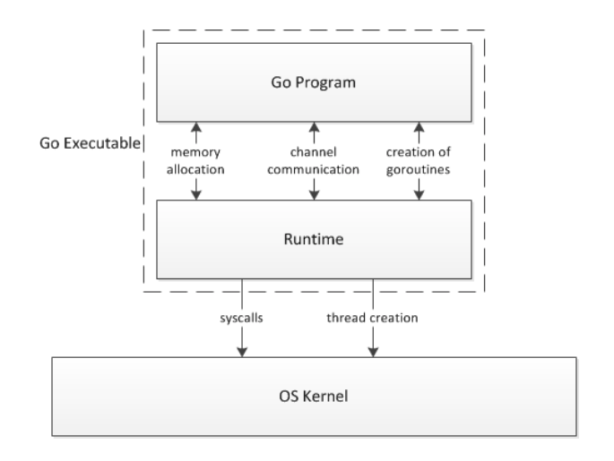

<!-- TOC -->

- [1. gorountine 原理分析](#1-gorountine-原理分析)
    - [1.1. 介绍](#11-介绍)
        - [1.1.1. goroutine 和内核线程区别](#111-goroutine-和内核线程区别)
        - [1.1.2. 协程的历史以及特点](#112-协程的历史以及特点)
    - [1.2. go runtime](#12-go-runtime)
    - [1.3. go调度器](#13-go调度器)
        - [1.3.1. 执行逻辑](#131-执行逻辑)
        - [1.3.2. 调度器改进](#132-调度器改进)
            - [1.3.2.1. P](#1321-p)
            - [1.3.2.2. 调度](#1322-调度)
            - [1.3.2.3. 调度点](#1323-调度点)
        - [1.3.3. poller](#133-poller)

<!-- /TOC -->
# 1. gorountine 原理分析

在谈gorountine之前，我们要先理解操作系统基本原理，线程是如何调度的等基本知识。
[传送门](os_thread.md)

## 1.1. 介绍

go中的并发是通过gorountine实现的，它的思路来自 C.A.R. Hoare发表的论文CSP(communicating sequential processes). gorountine本质上就是协程，只不过它做的比较好的点是，利用了多核，优化了调度器。

[CSP](http://usingcsp.com/cspbook.pdf)

### 1.1.1. goroutine 和内核线程区别

Golang 在 runtime、系统调用等多方面对 goroutine 调度进行了封装和处理，当遇到长时间执行或者进行系统调用时，会主动把当前 goroutine 的CPU (P) 转让出去，让其他 goroutine 能被调度并执行，也就是 Golang 从语言层面支持了协程。Golang 的一大特色就是从语言层面原生支持协程，在函数或者方法前面加 go关键字就可创建一个协程。

比较:
- 内存消耗方面
```
goroutine：2KB 
线程：8MB
```
- 内核线程和goroutine切换调度开销方面
```
内核线程：涉及模式切换、寄存器、PC、SP...等寄存器的刷新等。
goroutine：只有三个寄存器的值修改 - PC / SP / DX.
```

### 1.1.2. 协程的历史以及特点

　　协程（Coroutine）是在1963年由Melvin E. Conway USAF, Bedford, MA等人提出的一个概念。而且协程的概念是早于线程（Thread）提出的。但是由于协程是非抢占式的调度，无法实现公平的任务调用。也无法直接利用多核优势。因此，我们不能武断地说协程是比线程更高级的技术。

　　尽管，在任务调度上，协程是弱于线程的。但是在资源消耗上，协程则是极低的。一个线程的内存在 MB 级别，而协程只需要 KB 级别。而且线程的调度需要内核态与用户的频繁切入切出，资源消耗也不小。

我们把协程的基本特点归纳为：

- 协程调度机制无法实现公平调度
- 协程的资源开销是非常低的，一台普通的服务器就可以支持百万协程。

那么，近几年为何协程的概念可以大热。主要原因是网络编程的发展。与一般的计算机程序相比，网络编程有其独有的特点。

- 高并发（每秒钟上千数万的单机访问量）
- Request/Response。程序生命期端（毫秒，秒级）
- 高IO，低计算（连接数据库，请求API）。

最开始的网络程序其实就是一个线程一个请求设计的。后来，随着网络的普及，诞生了C10K问题。Nginx 通过单线程异步 IO 把网络程序的执行流程进行了乱序化，通过 IO 事件机制最大化的保证了CPU的利用率。

至此，现代网络程序的架构已经形成。基于IO事件调度的异步编程。其代表作恐怕就属 NodeJS 了吧。

## 1.2. go runtime

go作为高级编程语言，go runtime 管理了调度器，垃圾回收，goroutine运行时环境等。go是直接编译为系统可执行文件，不像java，底层还有JVM。不过这里为了方便理解，可以这样认为，如下图，显示了go程序运行时与操作系统的关系。任何系统层的调用都会被runtime层拦截，用于goroutine的调度和垃圾回收处理等工作。调度器会追踪每个goroutine，并且调度它们去线程池执行。因此，如何有效的调度goroutine，尽量保证公平及减小阻塞影响是调度算法的关键。



## 1.3. go调度器

为了方便理解，这里先从golang1.1之前的实现开始说明大致逻辑。在go runtime中,有三个结构体用于调度处理.分别是G,M和SCHED。

**G的结构**

表示一个goroutine
```
 struct G {
    byte∗ stackguard; //堆栈保护信息
    byte∗ stackbase; //栈底
    byte∗ stack0; //栈指针
    byte∗ entry; //初始化的function
    int16 status; //状态
    G* nextg; // 队列尾指针
    ... 
};
```
**M的结构**

表示具体执行的线程
```
struct M
{
    G∗ curg; // 运行中的goroutine
    MCache ∗mcache; // 线程缓存
    uintptr createstack [32]; // 创建线程是分配的Stack
    M* nextwaitm;
    ...
};
```
**Sched的结构**

全局单例结构体，主要是维护了可用队列
```
struct Sched {
    Lock;
    G ∗gfree;//可用的G,(status == Gdead)
    G ∗ghead; //等待运行的G队列头
    G ∗gtail; //等待运行的G队列尾
    int32 gwait;  //g等待数
    int32 gcount;  //g总数
    int32 grunning; //g运行中数量(得到cpu的G或者被系统阻塞的G)
    M ∗mhead;  // M队列头
    int32 mwait;  //m等待数
    int32 mcount; //m总数
    ... 
};
∗gfree 相当于回收的G，用于被重利用
∗ghead 这个队列会被M用到
```
### 1.3.1. 执行逻辑

go程序启动时，会启动一些goroutine，其中一个就是管理垃圾回收，一个是管理调度器，还有就是用户代码。同时，会启动一个M去跑管理调度的G。随着程序运行，更多的G被用户代码创建。更多的M也会被创建，去并行运行不同G。当M数达到设置的GOMAXPROCS数时，就不会再创建。因为，再创建更多的**活动**的M，不会提高运行效率，反而可能因为cpu的调度消耗而降低。当然，这并不是说永远不创建新的M。如果一个M运行的G结束了，它就会去全局Sched去取一个G。

大致的调度逻辑如下：
- 1.如果一个G运行到读取通道数据时会被阻塞，但是操作系统并不知道（通道是在runtime层），因此，调度器会把它添加了等待队列，而M并不会被阻塞，它会再去取一个G去接着运行。当通道被其它goroutine发送了数据时，它会激活所有等待的G，把这些G添加到可用队列中去等待得到一个运行的M。
- 2.如果G在运行时要调用系统库，在runtime层被拦截之后，调度器必须去M队列取一个空闲的M唤醒，而运行此G的M就会被阻塞，而进入等待状态。这样可以保证阻塞的G不影响其它的G得到M运行。如果阻塞之前有GOMAXPROCS个活动的M，此时会有GOMAXPROCS+1个运行的M，只不过其中一个M被阻塞。直到系统调用完成，中断唤醒此线程，它被添加到就绪队列尾等待CPU，一旦这个被阻塞的M得到CPU开始运行，如果此时M数超过GOMAXPROCS，它就可以把此G放到等待队列尾，自己休眠。否则，这个M就可以接着运行。

但是，以前结构有四个主要问题。
- 1.Sched中取G运行，会用到全局锁(Sched.Lock)，cpu核越多，性能影响越大。而且这个mutex保护着所有相关的goroutine的一些操作，如创建，完成，被调度。
- 2.一个G在运行过程中被调度多次，也就是会被多个不同的M执行。这无形中增加了负载和延迟。
- 3.每个M会有自己的缓存(2MB)，当M空闲而休眠时，缓存前没有被利用而浪费了主存。
- 4.大量的M(线程)因为G的系统调用而阻塞和唤醒，浪费了大量的cpu时间.

### 1.3.2. 调度器改进

#### 1.3.2.1. P

为了优化以上问题。P被提出来。原来的G和M不变。**P代表了G要运行的资源，也类似于一个处理器**
。全局的Sched中的一些属性被移动到了P上。

**P的结构**
```
struct P
{
    Lock;
    G *gfree; // 来自sched
    G *ghead; // 来自sched
    G *gtail;
    MCache *mcache; // 来自M
    FixAlloc *stackalloc; // 来自M
    uint64 ncgocall;
    GCStats gcstats;
    
    ...
};

同时Sched中也会维护P:

P *allp; // [GOMAXPROCS]
P *idlep; // 空闲的P

```

当一个M要请求一个G时，它要先去队列头取一个可用的P。结束执行后还到队列中。每个P都有自己等待运行的G队列和缓存。P最多有GOMAXPROCS个。这个机制可以解决上面MCache大量浪费问题。而且，P在执行时不用去全局Sched中取G，而是从自己的队列中取，因此不会有锁。

当一个G被M创建时，这要确保G马上被另一个M执行（如果不是所有的M在忙碌）。同时，当一个M因此系统调用而阻塞时，也要确保有另一个M去执行其它的G。为了防止频繁的执行中的M暂时的不可用，加重负载。因此，在M不可用之前，它要保存至少有一个空转的M，这个空转的M有两层：

- 1.M拿到了P，它一直在找一个可用的G
- 2.M没有P，它一直在找一个可用的P
同一时间，最多有GOMAXPROCS个空转的M。

#### 1.3.2.2. 调度

- 当一个G被创建时，它会被添加到当前的P队列中，当P结束执行当前的G，它会在自己的队列中取一个G，如果队列中没有G，它会随机去另一个P中偷取一半的G来执行，这个机制保证不会有空闲的P。我们可以想像成有4个核的cpu在执行，每个核中都有自己分组的进程在执行，当某个核执行完自己组里的所有进程时，为了不让它闲着，而其它核又在干活，所以随机从另一个组分一半任务给它做。[work-stealing]
- 当一个M阻塞时，它会把P移交出出，另一个空转的M会拿到这个P接着运行。当这个阻塞的M返回运行时，它会试着去取一个P来运行，如果队列中没有，它就会把刚才执行阻塞的G添加到全局的队列中，自己休眠。同时P也要周期性的去全局队列中取G，防止全局队列G饥饿。

 **work-stealing算法还有个好处，就是当P中的某个G在执行长时间的cpu计算或者死循环时，其它执行完的P可以把当前P的G取走执行**

#### 1.3.2.3. 调度点

Goroutine在几种情况会发生调度：

- 一个G被创建[go func()]
- 一个G被调用进程内阻塞之前
    - sleep
    - channel操作
    - 一些原生的包接口
- 一个G调用系统接口，导致线程阻塞之前

Goroutine非常轻，大量的内阻塞其实不会有资源浪费，都是在go runtime内调度，对操作系统是透明的，利用非常高，而且一个goroutine占用内存也非常小，因此可以大量分配。

### 1.3.3. poller

如果有上万个M阻塞在系统I/O调用时，性能开销也是非常大的。比如作为一个http服务器，"net/http"包中,第当接收到一个新请求时，它会创建一个goroutine去处理。如果同时有大量的请求，就会有大量的内核线程存在阻塞在I/O操作中，系统开销非常大。显然就是不可接受的，因此，要解决这个问题，可用利用系统提供的异步IO功能，把阻塞I/O变为异步I/O。这个过程就要用到poller。go 在启动时main之前，就会先启用一个独立的内核线程sysmon，sysmon其中一个主要的任务就是处理系统调用。

首先，你要大致了解异步系统I/O（比如[Epoll](https://en.wikipedia.org/wiki/Epoll)）

```
比如POXIS中创建一个epoll,它会返回一个文件描述符:
int epoll_create1(int flags);
Creates an epoll object and returns its file descriptor. The flags parameter allows epoll behavior to be modified. It has only one valid value, EPOLL_CLOEXEC. epoll_create() is an older variant of epoll_create1() and is deprecated as of Linux kernel version 2.6.27 and glibc version 2.9.[4]
```

底层非阻塞io是如何实现的呢？简单地说，所有文件描述符都被设置成非阻塞的，某个goroutine进行io操作，读或者写文件描述符，如果此刻io还没准备好，则这个goroutine会被放到系统的等待队列中，这个goroutine失去了运行权，但并不是真正的整个系统“阻塞”于系统调用。
后台还有一个poller会不停地进行poll，所有的文件描述符都被添加到了这个poller中的，当某个时刻一个文件描述符准备好了，poller就会唤醒之前因它而阻塞的goroutine，于是goroutine重新运行起来。


