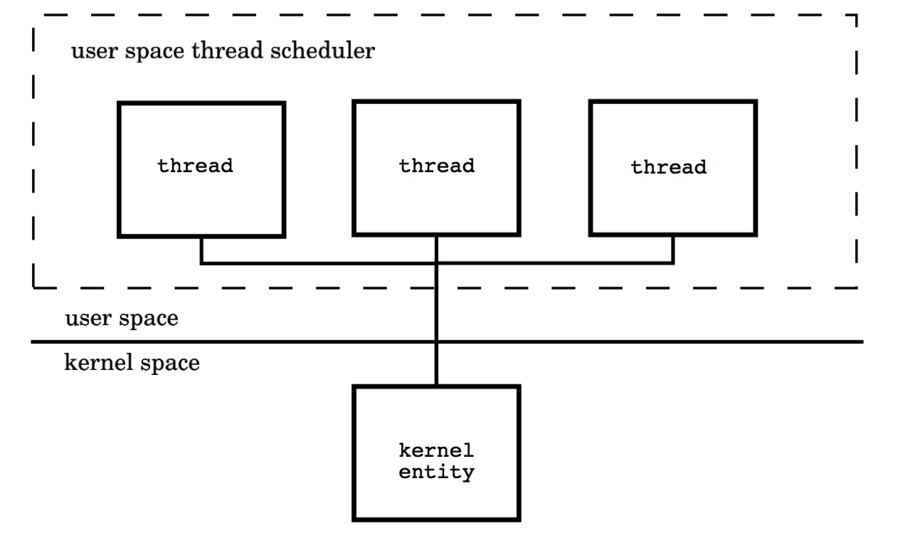
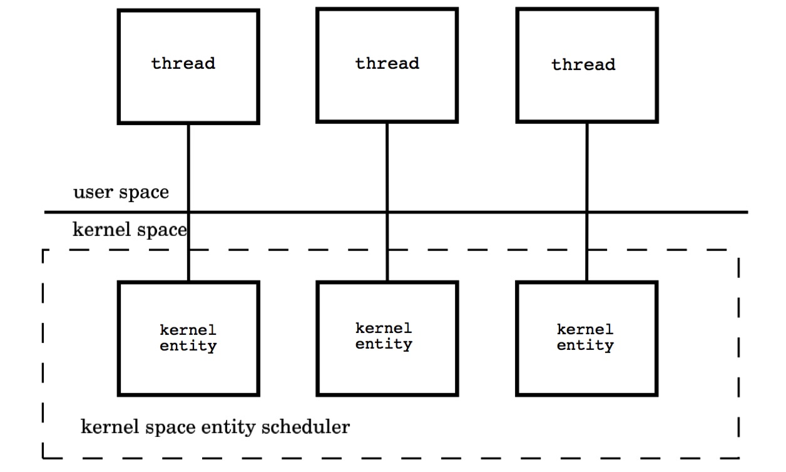
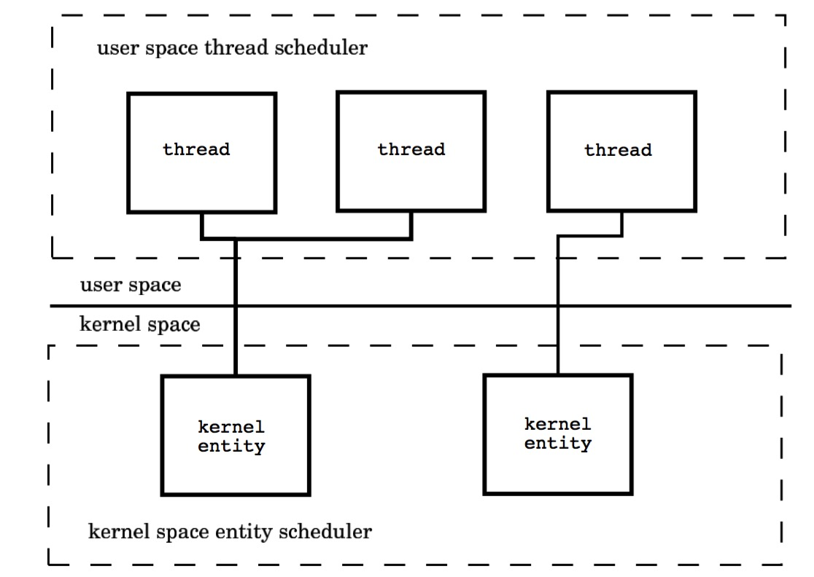

# 1. 操作系统
<!-- TOC -->

- [1. 操作系统](#1-操作系统)
    - [1.1. 进程](#11-进程)
    - [1.2. 线程](#12-线程)
        - [1.2.1. 用户级线程](#121-用户级线程)
        - [1.2.2. 内核级线程](#122-内核级线程)
        - [1.2.3. 混合模型](#123-混合模型)
            - [1.2.3.1. 用户空间线程模型（M : 1）](#1231-用户空间线程模型m--1)
            - [1.2.3.2. 用户空间线程模型](#1232-用户空间线程模型)
            - [1.2.3.3. 内核用户空间线程模型（M : N）](#1233-内核用户空间线程模型m--n)

<!-- /TOC -->
## 1.1. 进程

在早期单核时代，进程是操作系统中执行任务的最小调度单位，也是资源的拥有者。系统会维护一个**PCB**（Process Control Block），它描述进程标识，空间，运行状态，资源使用等信息。当一个进程在占用cpu执行时，操作系统是无法管理的，除非进程主动调用系统内核（内中断，**trap指令**）。或者，产生**中断INT**（比如时间片轮转就是使用时钟中断），进入中断处理程序（内核）进行调用。当然，调度算法有很多，目的就是为了降低进程处理响应时间和让处理任务并发执行，也就是各进程在微观上轮流占用cpu，宏观上是并发在执行，在这里就不作说明，感兴趣可以去看操作系统书。

上面的内容主要是为了说明两个内容：
- 1. 占有cpu执行中进程，在没有中断情况，操作系统是无法强制剥夺它占用的cpu的。因为操作系统内核程序已经被挂起。
- 2. 占用cpu的进程，在两种情况下会进入内核程度；第一，内中断（trap，比如，执行系统调用），第二，外中断（比如时钟中断）

进入系统调度时，系统要保存进程执行现场信息，如PS（或PSW，程序状态字）和PC（程序计数器寄存器）等。从就绪队列头取出一个PCB，恢复此进程现场开始执行。

在上面的切换中，涉及到两个概念：**内核态**和**用户态**。cpu在执行内核程序时为内核态，可以执行特权指令（比如操作I/O设备）。其它为用户态。

```
     ----------------------
用户态      用户进程
     ----------------------
内核态      系统内核
     ----------------------
```

## 1.2. 线程

随着互联网的发展及cpu多核出现，进程的缺点越来越明显，主要表现为：

- 进程状态的转换调度会浪费大量的处理器时间
- 进程的并发粒度太粗，无法应对当今分布式及并行算计系统 

为了更高效利用cpu，实现同一作业并发执行，加速进程的运行速度，引入线程概念。在一个进程中可以包含多个可以并发执行的线程。系统按进程分配除cpu以外的系统资源（如主存），线程变为进程内部执行单元，线程不拥有系统资源（比如不用分配主存），而是共享程度区和数据区，只给线程分配各自运行的栈区。因此，线程可以被频繁的调度的切换。

### 1.2.1. 用户级线程

在早期，有些操作系统不支持线程时，程序只能自己模拟线程。也就是说操作系统是按一个进程在调度，但是在进程内部，会有自己的线程管理及调度器。但是，与第一节上讲的原理一样，如果某个线程在执行时，它不主动让出cpu，调度器是无法执行的，也就无法实现线程并发执行，而且操作系统只调度进程，它是不知道内部的线程的。因此，要实现这点，**每个任务必须协同工作，一个任务跑一会之后，主动调用线程调度器**。当然，这部分工作时在用户程度调用语言底层一些方法时，在底层主动去执行线程调度器达到调度的目的。

这种对操作系统透明的线程就叫**用户级线程**。线程切换效率非常高，但是它有些缺点：

- 多个线程无法占用多个cpu
- 如果一个线程阻塞，所有的线程就被阻塞了

### 1.2.2. 内核级线程

内核级线程又名**轻进程**. 利用操作系统提供了的线程库创建的线程就是内核线程，在多线程支持的操作系统中，调度的最小单位就是线程，系统维护PCB和TCB列表，创建进程时，主方法就是第一个默认创建的线程。内核级线程的创建及切换比进程轻很多。而且一个线程的阻塞不会影响其它线程的执行。线程由TCB（线程控制块），用户堆栈，系统堆栈等组成。


相比于用户级线程的缺点：

- cpu会从用户态陷入内核态再切到用户态，消耗较大

### 1.2.3. 混合模型

由于以上的各自的缺点，大多数情况下会采用混合方式，即内核线程与用户线程混合使用。可分为三大类：

- 1:1 一个内核线程一个用户线程
- N:1 一个内核线程对应N个用户线程模型
- N:M混合线程模型 

以上模型都有各自的优缺点，比如，1：1模型消耗还是较大，N:1模型中如果内核线程阻塞也会导致用户线程阻塞。不过，N:M模型实现最复杂，也是最常用的模型。

#### 1.2.3.1. 用户空间线程模型（M : 1）
一个多线程子系统有可能全部由用户代码实现，这些线程的调度与切换全部发生在用户地址空间，这种模型通常是由一个内核线程和多个用户线程组成。典型的实现是基于 POSIX 线程 draft 4，OSF’DCE 是其中一种具体实现。一个用户空间库负责线程的创建、终止、调度与同步。这些线程对于操作系统内核是透明的。

这种模型的好处是线程上下文切换都发生在用户空间，避免的模态切换（mode switch），从而对于性能有积极的影响。然而不好的地方是所有的线程基于一个内核调度实体即内核线程，这意味着只有一个处理器可以被利用，在多处理环境下这是不能够被接受的，本质上，用户线程只解决了并发问题，但是没有解决并行问题。

还有一点，如果线程因为 I/O 操作陷入了内核态，内核态线程阻塞等待 I/O 数据，则所有的线程都将会被阻塞，用户空间也可以使用非阻塞而 I/O，但是还是有性能及复杂度问题。



#### 1.2.3.2. 用户空间线程模型

内核空间线程模型（1：1）
对于用户空间线程模型，所有的用户线程都和特定的内核线程进行交互，而内核空间线程模型是每个用户线程都和一个特定的内核线程进行交互，用户线程和内核线程是 1：1 的关系。典型的实现是将每个用户线程映射到一个内核线程上。

每个线程由内核调度器独立的调度，所以如果一个线程阻塞则不影响其他的线程。然而，创建、终止和同步线程都会发生在内核地址空间，这可能会带来较大的性能问题。在创建线程的时候内核必须要进行内存锁的申请，并负责调度线程，而且每个线程都要消耗有限的内核资源，当大量的线程被创建的时候，体现的尤为明显。值得夸奖的是，在多核处理器的硬件的支持下，内核空间线程模型支持了真正的并行，下面是内核空间模型示意图：




#### 1.2.3.3. 内核用户空间线程模型（M : N）
内核用户空间线程模型中，内核线程和用户线程的数量比为 M : N，因此也通常被叫做 M : N 线程模型，内核用户空间综合了前两种的优点。

这种模型需要内核线程调度器和用户空间线程调度器相互操作，本质上是多个线程被绑定到了多个内核线程上，这使得大部分的线程上下文切换都发生在用户空间，而多个内核线程又可以充分利用处理器资源，模型图如下：

