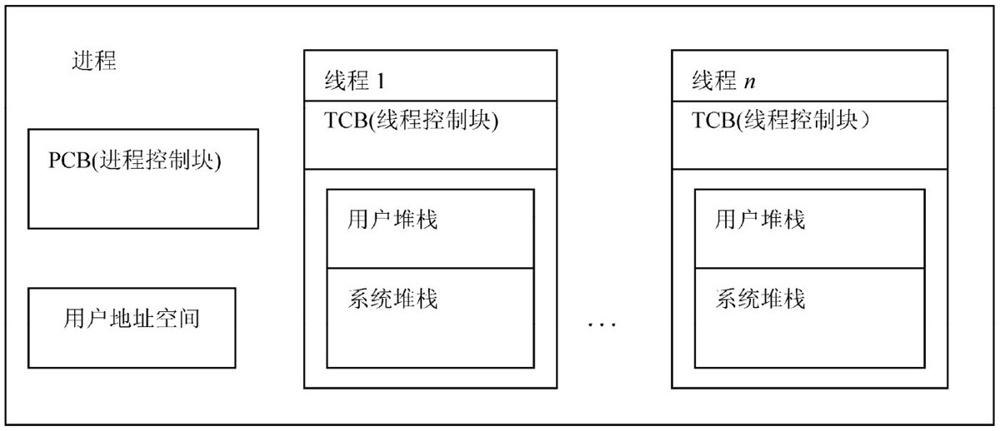

# 操作系统

## 进程

在早期单核时代，进程是操作系统中执行任务的最小调度单位，也是资源的拥有者。系统会维护一个**PCB**（Process Control Block），它描述进程标识，空间，运行状态，资源使用等信息。当一个进程在占用cpu执行时，操作系统是无法管理的，除非进程主动调用系统内核（内中断，**trap指令**）。或者，产生**中断INT**（比如时间片轮转就是使用时钟中断），进入中断处理程序（内核）进行调用。当然，调度算法有很多，目的就是为了降低进程处理响应时间和让处理任务并发执行，也就是各进程在微观上轮流占用cpu，宏观上是并发在执行，在这里就不作说明，感兴趣可以去看操作系统书。

上面的内容主要是为了说明两个内容：
- 1. 占有cpu执行中进程，在没有中断情况，操作系统是无法强制剥夺它占用的cpu的。因为操作系统内核程序已经被挂起。
- 2. 占用cpu的进程，在两种情况下会进入内核程度；第一，内中断（trap，比如，执行系统调用），第二，外中断（比如时钟中断）

进入系统调度时，系统要保存进程执行现场信息，如PS（或PSW，程序状态字）和PC（程序计数器寄存器）等。从就绪队列头取出一个PCB，恢复此进程现场开始执行。

在上面的切换中，涉及到两个概念：**内核态**和**用户态**。cpu在执行内核程序时为内核态，可以执行特权指令（比如操作I/O设备）。其它为用户态。

```
     ----------------------
用户态      用户进程
     ----------------------
内核态      系统内核
     ----------------------
```

## 线程

随着互联网的发展及cpu多核出现，进程的缺点越来越明显，主要表现为：

- 进程状态的转换调度会浪费大量的处理器时间
- 进程的并发粒度太粗，无法应对当今分布式及并行算计系统 

为了更高效利用cpu，实现同一作业并发执行，加速进程的运行速度，引入线程概念。在一个进程中可以包含多个可以并发执行的线程。系统按进程分配除cpu以外的系统资源（如主存），线程变为进程内部执行单元，线程不拥有系统资源（比如不用分配主存），而是共享程度区和数据区，只给线程分配各自运行的栈区。因此，线程可以被频繁的调度的切换。

### 用户级线程

在早期，有些操作系统不支持线程时，程序只能自己模拟线程。也就是说操作系统是按一个进程在调度，但是在进程内部，会有自己的线程管理及调度器。但是，与第一节上讲的原理一样，如果某个线程在执行时，它不主动让出cpu，调度器是无法执行的，也就无法实现线程并发执行，而且操作系统只调度进程，它是不知道内部的线程的。因此，要实现这点，**每个任务必须协同工作，一个任务跑一会之后，主动调用线程调度器**。当然，这部分工作时在用户程度调用语言底层一些方法时，在底层主动去执行线程调度器达到调度的目的。

这种对操作系统透明的线程就叫**用户级线程**。线程切换效率非常高，但是它有些缺点：

- 多个线程无法占用多个cpu
- 如果一个线程阻塞，所有的线程就被阻塞了

### 内核级线程

内核级线程又名**轻进程**. 利用操作系统提供了的线程库创建的线程就是内核线程，在多线程支持的操作系统中，调度的最小单位就是线程，系统维护PCB和TCB列表，创建进程时，主方法就是第一个默认创建的线程。内核级线程的创建及切换比进程轻很多。而且一个线程的阻塞不会影响其它线程的执行。线程由TCB（线程控制块），用户堆栈，系统堆栈等组成。



相比于用户级线程的缺点：

- cpu会从用户态陷入内核态再切到用户态，消耗较大

### 混合模型

由于以上的各自的缺点，大多数情况下会采用混合方式，即内核线程与用户线程混合使用。可分为三大类：

- 1:1 一个内核线程一个用户线程
- N:1 一个内核线程对应N个用户线程模型
- N:M混合线程模型 

以上模型都有各自的优缺点，比如，1：1模型消耗还是较大，N:1模型中如果内核线程阻塞也会导致用户线程阻塞。不过，N:M模型实现最复杂，也是最常用的模型。
