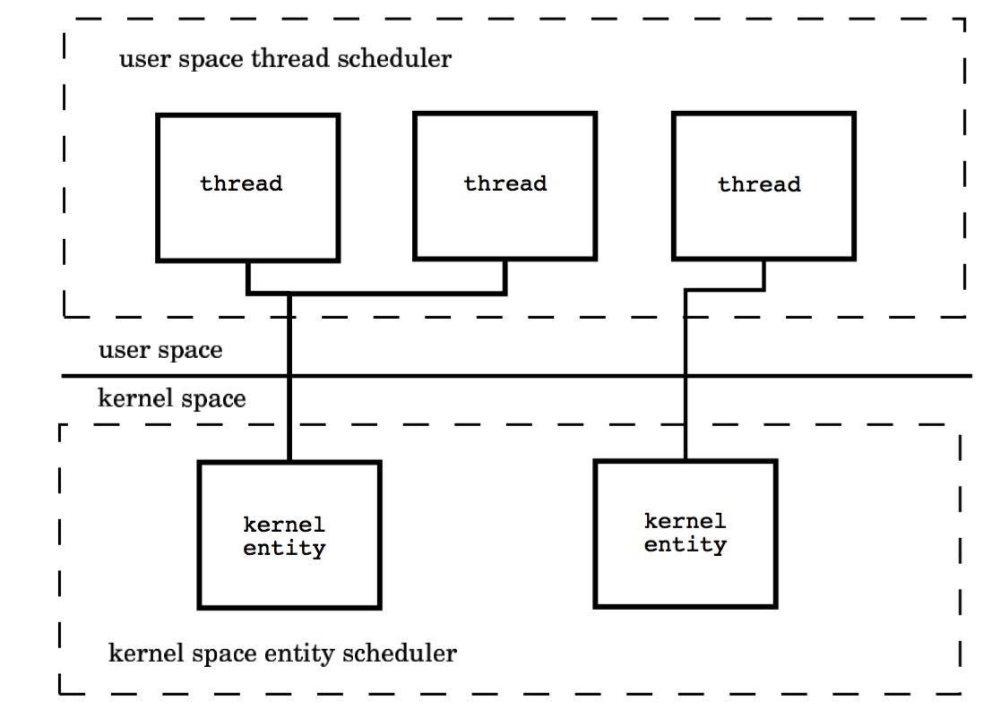

# 线程模型
线程模型在不同的操作系统下的实现通常有三种，每种模型都有其优点与缺点，下面我们来看看这三种线程模型。

## 用户空间线程模型（M : 1）
一个多线程子系统有可能全部由用户代码实现，这些线程的调度与切换全部发生在用户地址空间，这种模型通常是由一个内核线程和多个用户线程组成。典型的实现是基于 POSIX 线程 draft 4，OSF’DCE 是其中一种具体实现。一个用户空间库负责线程的创建、终止、调度与同步。这些线程对于操作系统内核是透明的。

这种模型的好处是线程上下文切换都发生在用户空间，避免的模态切换（mode switch），从而对于性能有积极的影响。然而不好的地方是所有的线程基于一个内核调度实体即内核线程，这意味着只有一个处理器可以被利用，在多处理环境下这是不能够被接受的，本质上，用户线程只解决了并发问题，但是没有解决并行问题。

还有一点，如果线程因为 I/O 操作陷入了内核态，内核态线程阻塞等待 I/O 数据，则所有的线程都将会被阻塞，用户空间也可以使用非阻塞而 I/O，但是还是有性能及复杂度问题。

## 用户空间线程模型

内核空间线程模型（1：1）
对于用户空间线程模型，所有的用户线程都和特定的内核线程进行交互，而内核空间线程模型是每个用户线程都和一个特定的内核线程进行交互，用户线程和内核线程是 1：1 的关系。典型的实现是将每个用户线程映射到一个内核线程上。

每个线程由内核调度器独立的调度，所以如果一个线程阻塞则不影响其他的线程。然而，创建、终止和同步线程都会发生在内核地址空间，这可能会带来较大的性能问题。在创建线程的时候内核必须要进行内存锁的申请，并负责调度线程，而且每个线程都要消耗有限的内核资源，当大量的线程被创建的时候，体现的尤为明显。值得夸奖的是，在多核处理器的硬件的支持下，内核空间线程模型支持了真正的并行，下面是内核空间模型示意图：

## 内核用户空间线程模型（M : N）
内核用户空间线程模型中，内核线程和用户线程的数量比为 M : N，因此也通常被叫做 M : N 线程模型，内核用户空间综合了前两种的优点。

这种模型需要内核线程调度器和用户空间线程调度器相互操作，本质上是多个线程被绑定到了多个内核线程上，这使得大部分的线程上下文切换都发生在用户空间，而多个内核线程又可以充分利用处理器资源，模型图如下：

